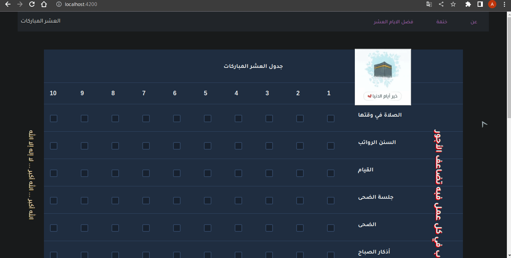

# First10

a way to keep up with the first days of z-elHega

## features

- keep track for 16 good wills 
- all progress is saved locally in the browser
- no internet needed after first run

## Run gif

## Requirements

- [npm](https://npmjs.com)
- [angularCli](https://angular.io/cli)
  - `npm install -g @angular/cli`

## Running

- clone the repo 
  - `git clone https://github.com/AmSaleh21/graceful-first-10.git`
    
- `cd graceful-first-10`
  
- run `ng serve` from project root
  
- from browser go to `localhost:4200`
  
